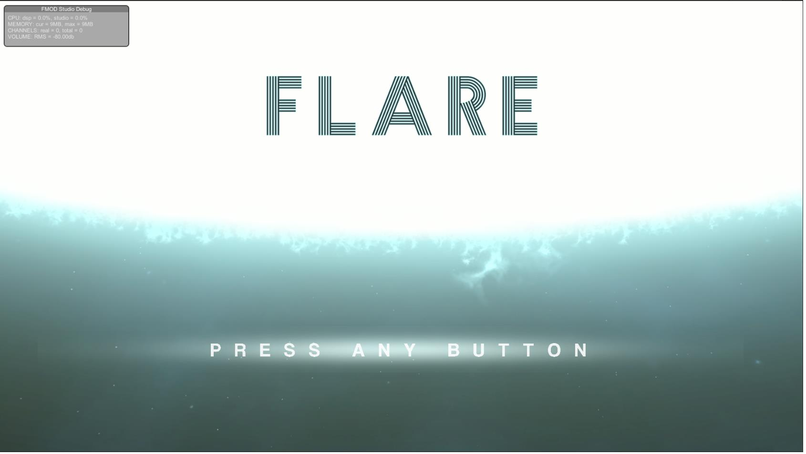

# FLARE

Flare is a 2D space survival shooter game i programmed and designed. 

You play as a new born star absorbing other stars cores to evolve and grow. But they will not let you win without a fight.

The game start with a start menu leading to a simple intro sequence where you are born from a large star that sends you off to you off to a place in the galaxy to start your journey.
The gameplay concists of you shooting other stars and upgrading yourself by leveling up so increase your base stats and by absorbing cores to evolve with new feature upgrades.

The game is not a complete but a system prototype and has some core systems in place.

Base stats like max health, attack speed, damage, health regen, movement speed are upgradable.

Upgrades are in place: Pulsar(Laser beam), White dwarf(Small autonomous minion), Multinova(Shotgun), Seeker(Homin projectiles), Unstable plasma(Mines), Corona(Shield), Core(Max Health), Wormhole(Dash movement)

Made a couple of enemies: Normal(Follows and shoots player), Heavy(Same as Normal but stronger), Mini Boss(Same as Heavy but stronger and shoots Multinova), Fast(Faster Normal enemy with faster atttack speed), Spinner(Heavy enemy with short laser beams shooting in 5 directions)

Made a spawning system based on enemies spawning having a cost and every spawn interval the spawner "bought" enemies to spawn procedurally.

Death screen with kill counter. Planned on adding upgrade and level up tracker to death screen but never did. Game restarts from start menu when continuing from death screen.

Very fun project that i wished i had made time to turn into something more complete and polished.

P.S. Some smaller bugs included.

.jpg)
.jpg)
.jpg)
.jpg)
.jpg)
.jpg)
.jpg)
.jpg)
.jpg)
